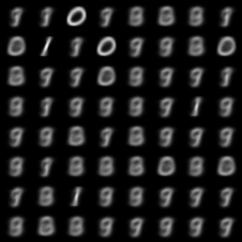

# Numerical Results

We evaluate posterior collapse using four complementary diagnostics: validation loss, rate, an approximate mutual-information proxy, and latent-intervention sensitivity.

The figures below summarize the main empirical claims of the repository.

---

## 1. Similar loss can hide very different latent usage

---

# Source - https://stackoverflow.com/a/69399550
# Posted by sgdata
# Retrieved 2026-03-25, License - CC BY-SA 4.0



### Agg Table

| COLUMN\_NAME                   | DESCRIPTION                                                                   |
| ------------------------------ | ----------------------------------------------------------------------------- |
| table_item_1                   | {{ docs("table_item_1") }}                                                  |
| table_item_2                   | {{ docs("table_item_2") }}                                                  |
| table_item_3                   | {{ docs("table_item_3") }}                                                  |
| table_item_4                   | {{ docs("table_item_4") }}                                                  |
                    


---
# Source - https://stackoverflow.com/a/69399550
# Posted by sgdata
# Retrieved 2026-03-25, License - CC BY-SA 4.0



### Agg Table

| COLUMN\_NAME                   | DESCRIPTION                                                                              |
| ------------------------------ | ---------------------------------------------------------------------------------------- |
| table_item_1                   | [first_model_description](#!/model/model.my_new_project.my_first_dbt_model#description)  |
| table_item_2                   | [first_model_columns](#!/model/model.my_new_project.my_first_dbt_model#columns)          |
| table_item_3                   | [table_item_doc](#!/docs/docs.my_new_project.table_item_3)                               |
| table_item_4                   | [table_item_doc](#!/docs/docs.my_new_project.table_item_4#description)                   |
                    



---

This figure compares the MI proxy with the reconstruction penalty incurred after modifying the latent variable.

The interpretation is simple: if the decoder is genuinely using the latent code, then changing or zeroing that code should noticeably worsen reconstruction. If the decoder is largely ignoring the latent code, then the reconstruction should change much less.

Accordingly, runs with larger MI proxy also tend to show stronger intervention effects. This provides an additional empirical check that the MI proxy is tracking meaningful latent usage rather than just numerical noise.

---

## 4. Target-rate training helps prevent collapse

This figure summarizes the target-rate experiments.

The target-rate objective explicitly penalizes deviation from a prescribed nonzero rate. Empirically, this keeps the model away from the fully collapsed regime more effectively than a plain beta-VAE objective. The achieved validation rate remains nontrivial, and the MI proxy also stays away from zero.

This is the main positive result of the project: target-rate training provides a practical mechanism for preserving latent usage.

---

## 5. KL alone can be misleading

This figure shows the constant-encoder control experiments.

These controls are designed so that the encoder is independent of the input. Therefore, the latent variable is not actually carrying meaningful information about \(x\). Nevertheless, the KL or rate term can still become large because of mismatch between the aggregated posterior and the prior.

This is conceptually important: a large KL term is not automatically evidence that the latent representation is informative. It may reflect prior mismatch rather than true information flow from input to latent.

---

## Representative Qualitative Examples

### Low-MI beta run

This reconstruction grid comes from a beta-run with relatively weak latent usage. The reconstructions may still look reasonable, but the quantitative diagnostics indicate that the latent variable is playing a limited role.

The intervention plot shows that modifying the latent code has a comparatively smaller effect, which is consistent with partial or near collapse.

---

### High-MI beta run

This reconstruction grid comes from a beta-run with stronger latent usage.

Here the effect of intervening on the latent code is more substantial. This is consistent with the larger MI proxy and supports the interpretation that this model is using the latent variable more meaningfully.

---

### Target-rate run

This example illustrates a representative target-rate model.

The main point is that the target-rate objective preserves a visibly active latent space while maintaining good reconstructions. Qualitatively and quantitatively, this is the intended contrast with collapse-prone beta-only training.

---

## Constant-Encoder Counterexamples

### Collapse with near-zero KL

This control corresponds to a degenerate setting where the encoder is constant and the KL remains small. It is a useful sanity check: low KL is compatible with collapse, which is the usual textbook warning.

### Collapse with large KL

This control is the more interesting counterexample. The encoder is still independent of the input, so the latent code is not informative, yet the KL can be large. This shows that large KL is not sufficient evidence of meaningful latent usage.

---

## Summary

The numerical experiments support four main conclusions:

1. Similar ELBO or validation-loss values do not guarantee similar latent usage.
2. Increasing beta tends to suppress both rate and mutual information.
3. Target-rate training helps keep the model away from collapse by enforcing nonzero rate.
4. KL alone is not a reliable proxy for how much information the latent variable carries about the input.
