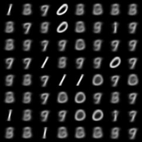
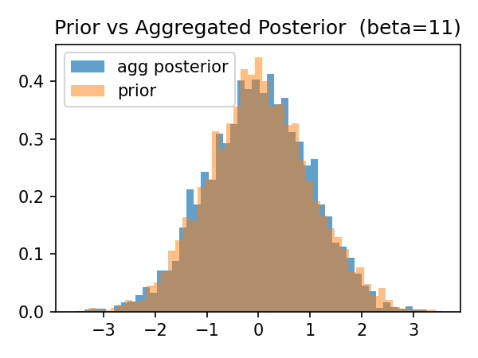
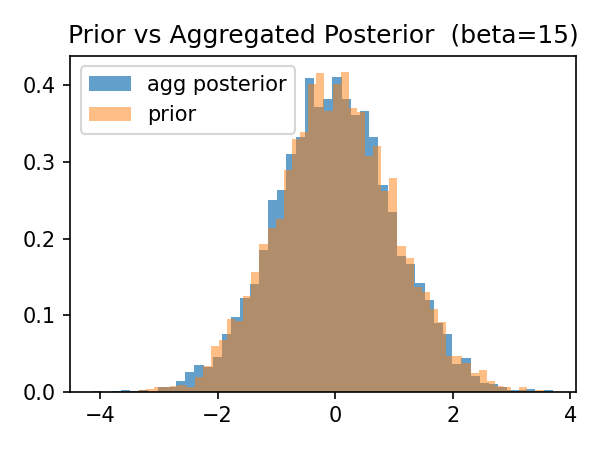
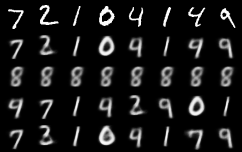
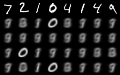
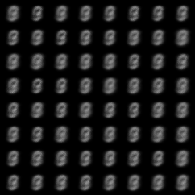
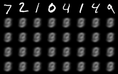
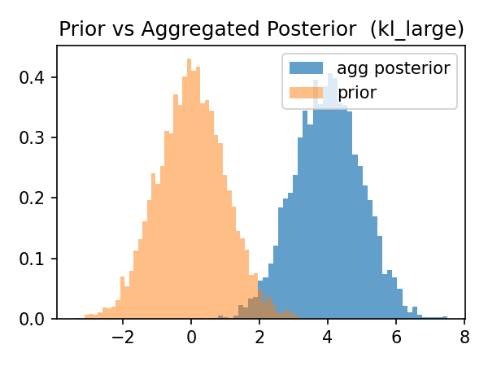

# Numerical Results

We evaluate posterior collapse using four complementary diagnostics: validation loss, rate, an approximate mutual-information proxy, and latent sensitivity.

Here we summarize the main empirical claims of the repository.

**Remark.**  
In the present MNIST experiments with relatively simple encoder/decoder architectures, we do not observe the sharpest form of posterior collapse, namely a regime in which reconstruction quality remains high while the latent variable is used only weakly or not at all. Such behavior is typically more pronounced when the decoder has enough expressive power to model the data while largely bypassing the latent representation. For this reason, the current experiments should be interpreted as demonstrating the diagnostic distinction between loss values, KL/rate, and actual latent usage, rather than as an exhaustive study of collapse under highly expressive decoders.

---

## 1. Similar loss values can hide very different latent usage

### Mutual information

The table below shows that two models with comparable total $\beta$-losses can nevertheless use the latent space in very different ways; compare with the discussion in [[1]](#1).

| Model | Total Loss | Mutual Information |
|---|---:|---:|
| $\beta=11$ | 185 | 4.86 |
| $\beta=15$ | 199 | 0.629 |

This gives a concrete numerical example of the phenomenon.

The two models have relatively close total $\beta$-loss values:
- moving from $\beta=15$ to $\beta=11$, the total loss decreases from 199 to 185, that is, by 14 units, or approximately $7.0\%$;
- equivalently, the total loss at $\beta=15$ is about $1.08$ times the total loss at $\beta=11$.

By contrast, the mutual information—and hence the degree of latent usage—changes dramatically:
- moving from $\beta=15$ to $\beta=11$, the mutual information increases from 0.629 to 4.86, that is, by about 4.23 units, or approximately $672.7\%$;
- equivalently, it is about $7.73$ times larger at $\beta=11$.

### Quality of latent encoding

Thus, models that look similar from the point of view of total $\beta$-loss can in fact behave very differently. In extreme cases, this difference appears as the contrast between an actively used latent space and posterior collapse. One indication of collapse is that unconditional generation becomes poor: if the decoder does not meaningfully use the latent variable, then sampling from the prior produces outputs with little semantic content.

   
  <em>Sampling from the prior for $\beta=11$.</em>

   
  <em>Sampling from the prior for $\beta=15$.</em>

Poor prior samples can, however, arise for two different reasons: either the model does not use the latent space, or the aggregated posterior is badly mismatched with the prior. We therefore examine the latter possibility explicitly. In the present comparison, there is no substantial mismatch effect.

| Model | KL Loss | $\beta \times$ KL Loss | Total Loss |
|---|---:|---:|---:|
| $\beta=11$ | 4.88 | 53.68 | 185 |
| $\beta=15$ | 0.645 | 9.67 | 199 |

The following plots show that the aggregated posterior and the prior are reasonably aligned in both cases.

   

   

To investigate posterior collapse more directly, we study how the reconstruction of a datapoint $x$ depends on the latent variable $z$. This provides a more direct test of whether the model encodes meaningful information in the latent space and whether the decoder actually uses that information during reconstruction.

In the figures below, we perform the following intervention experiment:
- first row: real data;
- second row: standard reconstructions;
- third row: reconstructions with constant latent code $z=0$;
- fourth row: reconstructions after shuffling the latent codes $z_i$ within the batch;
- fifth row: reconstructions after randomly perturbing the latent variable $z$.

   
  <em>Latent interventions for $\beta=11$.</em>

   
  <em>Latent interventions for $\beta=15$.</em>

The conclusion of this section is that making the KL term small is not, by itself, the goal. If $\beta$ is chosen too large, then the optimization can overemphasize prior matching and drive the model toward posterior collapse.

---

## 2. KL alone can be misleading: collapse despite large KL

The previous discussion might suggest that posterior collapse can be avoided simply by keeping the KL term away from zero. As we now show, that is not sufficient.

To demonstrate what can go wrong, even when the KL term is large, we consider controlled counterexamples based on a constant encoder. In these examples, the encoder is independent of the input, so the latent code is non-informative by construction. Nevertheless, the KL can be made arbitrarily large.

This is the more interesting control experiment: the encoder does not depend on the input, and therefore the latent variable carries no information about the data, yet the KL is large. Hence, a large KL value is not sufficient evidence of meaningful latent usage.

| Model | KL Loss | Total Loss | Mutual Information |
|---|---:|---:|---:|
| constant encoder with $\mathcal{N}(4,I)$ | 128 | 334 | 0 |

   
  <em>Sampling from the prior $\mathcal{N}(0,I)$.</em>

   
  <em>Latent interventions for the constant-encoder control.</em>

These figures show that the latent encoding quality is extremely poor, despite the large KL term.

   

The final figure shows that the KL term is nonzero only because of the severe mismatch between the aggregated posterior and the prior. In particular, the large KL here does not reflect informative latent encoding.

---

## 3. Target-rate run

The main point of the target-rate objective is to enforce a nontrivial information budget directly, rather than hoping that a suitable choice of $\beta$ will implicitly do so. In our experiments, the target-rate run preserves a visibly active latent space while maintaining good reconstructions. Both qualitatively and quantitatively, this is the intended contrast with collapse-prone $\beta$-only training.

We expand more on how optimizing this objective favors informative latent encoding in `notes/`.

## 3. Target-rate training mitigates posterior collapse

Compared with collapse-prone \(\beta\)-only training, the target-rate run exhibits:
- a substantially larger mutual-information proxy;
- visibly stronger sensitivity to latent interventions;
- improved prior samples;
- while maintaining good reconstruction quality.

Thus, in our experiments, target-rate training provides a more direct and reliable mechanism for preserving an active latent space.

---

## Summary

The numerical experiments support four main conclusions:

1. Similar ELBO or validation-loss values do not guarantee similar latent usage.
2. Choosing $\beta$ too large can suppress latent usage and lead to posterior collapse.
3. KL alone is not a reliable proxy for how much information the latent variable carries about the input.
4. Target-rate training provides a more direct mechanism for maintaining an active latent space.

## References
<a id="1">[1]</a>  
Alexander A. Alemi, Ben Poole, Ian Fischer, Joshua V. Dillon, Rif A. Saurous, and Kevin Murphy.  
**Fixing a Broken ELBO**.  
Proceedings of the 35th International Conference on Machine Learning (ICML), volume 80, pages 159–168, 2018.
